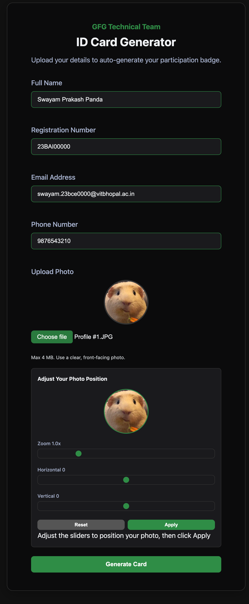
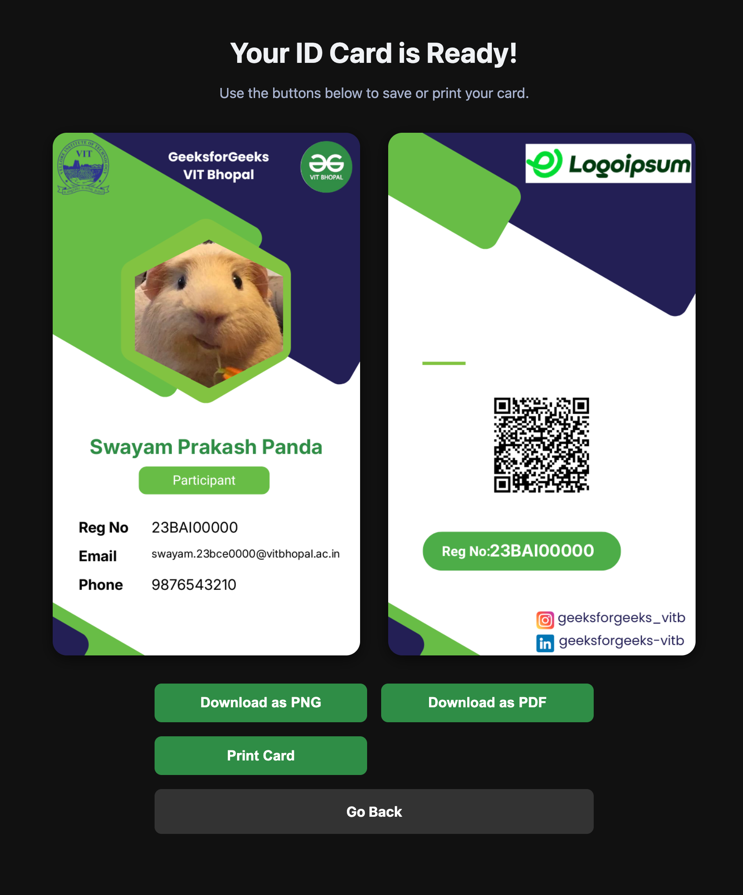

# GFG Technical Team – ID Card Generator

A simple, production-ready Flask web application that allows users to generate a participation ID card by filling out a form. This project focuses on a clean user experience, robust server-side validation, and image processing to superimpose user data onto a pre-designed card template.

## Screenshots
  

Initial Form Filling

  

Final Generated ID Card  

ID Card Verification  

## Features

-   **Simple Web Form**: Clean interface to input Name, Registration Number, and upload a photo.
-   **Live Preview**: Client-side validation with live feedback and photo preview.
-   **Image Superimposition**: Uses Python's Pillow library to dynamically place user details and photo onto base card templates (`front.png`, `back.png`).
-   **Hexagonal Photo Mask**: Applies a hexagonal crop to the user's photo to fit the design.
-   **Export Options**: Download the generated card as a high-resolution PNG, a PDF document, or print it directly.
-   **Print-Friendly**: Includes specific CSS to ensure the card prints to the standard ID size of 86x54mm.
-   **Secure & Robust**: Enforces file size and type limitations on both client and server.

## Tech Stack & Architecture

-   **Backend**: Python 3.10+, Flask 3.x
-   **Image Processing**: Pillow (PIL Fork)
-   **Frontend**: HTML5, Vanilla CSS (Flexbox/Grid), Vanilla JavaScript
-   **Export Libraries (CDN)**: `html2canvas`, `jspdf`
-   **Deployment Target**: Not decided yet